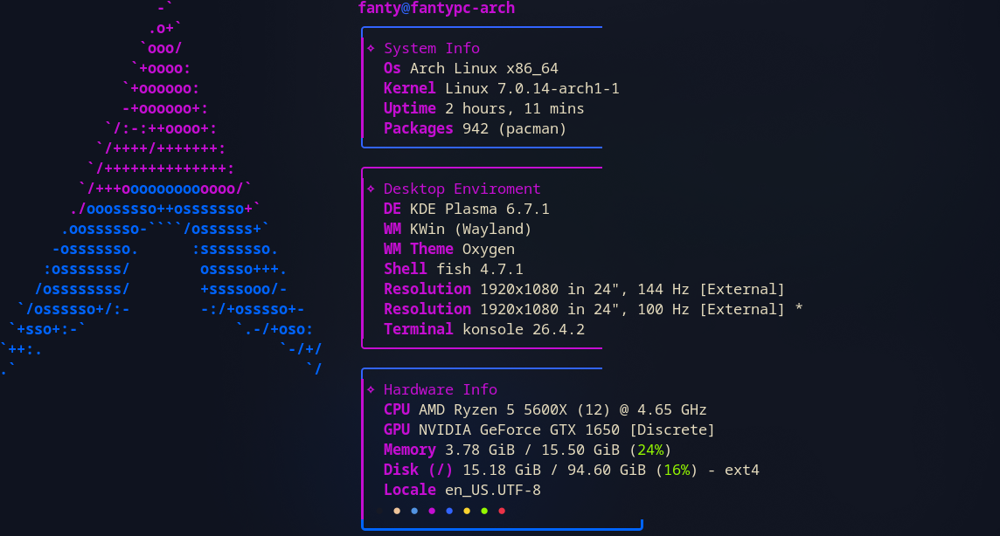

# my-fastfetch-config

My custom **Fastfetch** configuration running on **Arch Linux** on **KDE Plasma** with the **Konsole** terminal emulator. This repository serves as a backup for my configuration files (`config.jsonc`) and a quick way to deploy them on new machines.

---

## Preview

Here is the updated look of my terminal with this configuration:




---

## Install

Make sure you have `curl` and `fastfetch` installed and i recomend use Nerd Fonts on your terminal emulator. Then, simply run the command below in your terminal to create the directory and download the configuration file directly:

```bash
mkdir -p ~/.config/fastfetch && curl -fsSL https://raw.githubusercontent.com/Fanty1107/fastfetch-config/main/config.jsonc -o ~/.config/fastfetch/config.jsonc
```

## Automatic Execution (Optional)
If you want Fastfetch to run automatically every time you start Konsole, add the command to **your Shell** configuration file (usually ~/.bashrc or ~/.zshrc):
```bash
echo "fastfetch" >> ~/.yourShell
```

